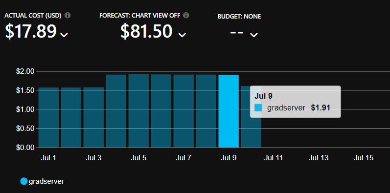
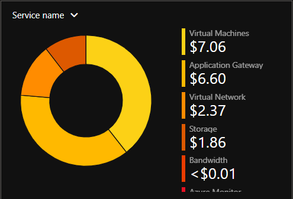

# 💰 Daily & Monthly Cost Estimation

This section provides a simple overview of the expected **Azure running costs** for the deployed environment based on actual resources used in this project.

---

## 📌 What’s Included

The cost estimation covers:
- **Virtual Machine**: Runs 24/7 to host both backend applications.
- **Application Gateway**: Handles reverse proxy, SSL termination, routing, and health probes.
- **Blob Storage**: Hosts the static frontend files with global reach.
- **Networking Costs**: Includes data transfer and public IPs.
- **Monitoring & Alerts**: Uses Azure Monitor, Activity Logs, and automated alerts.

---

## ✅ Estimated Cost

- **Daily:** ~ **$1.93 USD**
- **Monthly:** ~ **$58 USD**

These estimates are based on the deployed VM size, AGW configuration, storage used, and typical inbound/outbound data usage for the expected load.

✅ **Daily Cost :**  

---

✅ **Cost by service :**

---

## 🗂️ Notes

- Actual costs may vary depending on traffic, storage size, and scaling needs.
- The cost is reviewed regularly to optimize for performance vs. budget.
- Monitoring is included to avoid unexpected usage spikes.

---

_For the full deployment details, see [High-Level Architecture](./ARCHITECTURE.md)._  
_For monitoring and alerts that help control cost, see [Monitoring & Logging](./Monitoring-Logging.md)._
