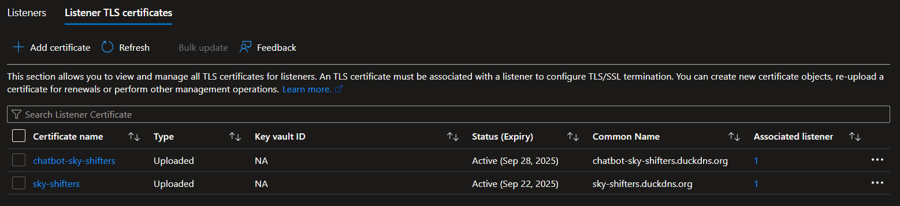
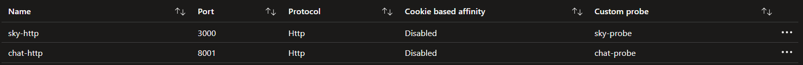

# ☁️ Application Gateway Reverse Proxy (Production)

In the **production setup**, the reverse proxy functionality was moved from the VM-level (NGINX) to a fully managed **Azure Application Gateway (AGW)**.

This transition provided advanced **Layer 7 load balancing**, centralized **SSL termination**, multi-site routing, and built-in health monitoring — resulting in better **performance**, **security**, and **scalability**.

---

## 🔀 **Why Move to Application Gateway?**

- ✅ Offloads **SSL/TLS termination** from the VM, freeing up resources.
- ✅ Provides native support for **multi-site hosting** (multiple custom domains on the same gateway).
- ✅ Enables **deep traffic inspection** and smart routing at the HTTP layer.
- ✅ Integrated **health probes** and **monitoring** for improved reliability.
- ✅ Simplifies scaling and management compared to maintaining NGINX manually.

---

## 🔐 **SSL Certificates**

- The SSL certificates originally created for the domains on NGINX were securely uploaded to the Application Gateway.
- This enables **SSL termination at the gateway level**: incoming HTTPS traffic is decrypted by the AGW, then forwarded to the backend VM over **HTTP** within the secure virtual network.

✅ **Example SSL Certificates in AGW:**  

---

## 🗂️ **Multi-Site Configuration**

The Application Gateway was configured in **multi-site mode** to route requests to multiple backend apps based on the requested hostname.

### **Custom Domains**

| Domain URL                                         | Target Application       | Port |
|----------------------------------------------------|--------------------------|------|
| [https://sky-shifters.duckdns.org/](https://sky-shifters.duckdns.org/) | Booking Application      | 3000 |
| [https://chatbot-sky-shifters.duckdns.org/](https://chatbot-sky-shifters.duckdns.org/) | Chatbot Application      | 8002 |

---

## 🧩 **Key Components Configuration**

### 1️⃣ **Listeners**

- A **Listener** defines how the gateway listens for incoming requests.
- Two HTTPS Listeners were created — one for each domain.
- Each listener is bound to its respective custom domain and SSL certificate.

✅ **Listeners Example:**  

---

### 2️⃣ **Rules**

- Each Listener has an associated **Routing Rule** that defines what happens when a request comes in.
- The rule:
  - Matches the incoming hostname.
  - Checks the health probe status.
  - Forwards the request to the correct backend pool and port.

**Example Routing:**
- `sky-shifters.duckdns.org` → VM on port 3000
- `chatbot-sky-shifters.duckdns.org` → VM on port 8002

✅ **Rules Example:**  

---

### 3️⃣ **Backend Pools**

- A **Backend Pool** represents the backend servers or VMs that handle requests.
- In this setup, the **same VM** is the backend for both applications.
- Each pool maps the domain to the correct port.

✅ **Backend Pools Example:**  

---

### 4️⃣ **Health Probes**

- Before routing traffic, the AGW uses **Health Probes** to check if the backend is up.
- Each app exposes a `/health` endpoint for lightweight status checks.
- If a probe fails, traffic is not forwarded, and an **Azure Alert** notifies the team by email.

✅ **Health Probes Example:**  

---

## 🗺️ **How Traffic Flows**

Here’s the full flow from user to backend and back:

1️⃣ A user sends an **HTTPS** request to one of the custom domains.

2️⃣ The request reaches the **Application Gateway**, where the **Listener** accepts it and uses the SSL certificate to decrypt it.

3️⃣ The **Routing Rule** checks the hostname and determines which **Backend Pool** to use.

4️⃣ The **Health Probe** verifies the backend app is healthy.

5️⃣ If healthy, the request is forwarded via **HTTP** to the VM over the secure internal network.

6️⃣ The backend app processes the request and returns the response back through the same secure path.

✅ **Production Flow Diagram:**  

---

## ✅ **Benefits Achieved**

✔ Centralized SSL termination reduces load on the VM.  
✔ Native support for multiple custom domains on one gateway.  
✔ End-to-end secure, encrypted communication for users.  
✔ Automatic failover if a backend app becomes unhealthy.  
✔ Easier to scale and manage compared to manually updating NGINX.

---

## 📁 **References**

- SSL Certificates stored and managed directly on AGW.
- All listeners, rules, pools, and probes configured via Azure Portal.
- VM remains focused on backend processing only.

---

_This production-grade reverse proxy setup ensures high availability, security, and scalability for the entire platform._ 🚀

👉 For more details on the backend hosting, see [Application Hosting](./Application-Hosting.md).  
👉 For how health monitoring works, see [Monitoring & Logging](./Monitoring-Logging.md).

---
