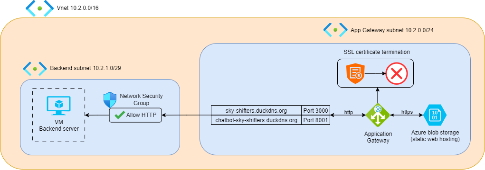
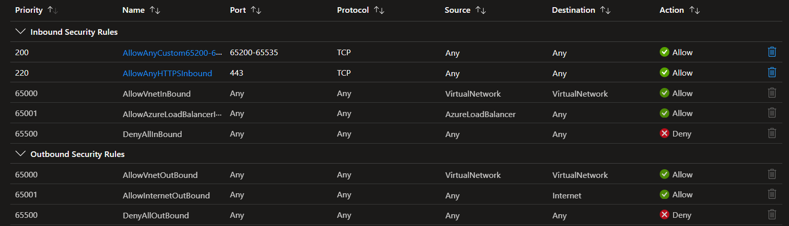
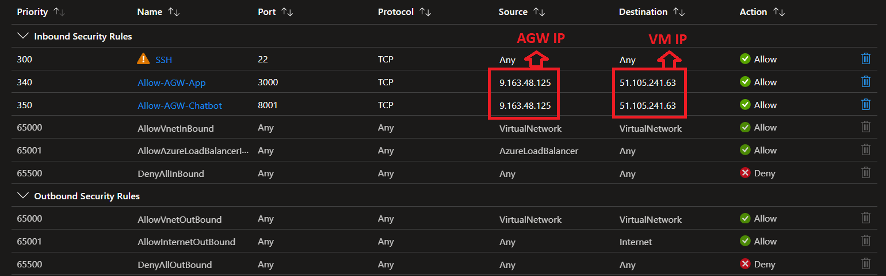

# 🔐 Networking & Security

To ensure a secure, well-organized, and efficient network setup, the entire production environment is deployed inside an **Azure Virtual Network (VNet)** with carefully designed **subnets** and **Network Security Groups (NSGs)**.

The main goal is to:
- ✅ Control how traffic flows between the internet, the **Application Gateway**, and the backend **Virtual Machine (VM)**.
- ✅ Block any unauthorized access.
- ✅ Minimize the attack surface by isolating components wherever possible.

---

## 📌 **VNet & Subnet Design**

### 1️⃣ **Virtual Network (VNet)**  
- Acts as the main container for all network resources.
- Provides **isolated networking** for the full architecture.
- Keeps all communication internal wherever possible.

---

### 2️⃣ **Subnets**

The VNet is divided into **two subnets** to separate roles and security scopes:

| Subnet         | Purpose                           | Address Range  |
|----------------|-----------------------------------|----------------|
| `appgw-subnet` | Hosts the **Azure Application Gateway** | `10.2.1.0/29` |
| `default`      | Hosts the **Virtual Machine** running backend apps | *(e.g., `10.2.0.0/24`)* |

---

**🔑 Key Design Points**

- **appgw-subnet**: Open to internet traffic **only** for HTTPS (TCP/443).  
  Everything else blocked by default.

- **default subnet**:  
  - Isolated from direct internet access.
  - Accepts only specific traffic from the Application Gateway and trusted CI/CD pipelines.

✅ **Netwrking archirecture:**  

---

## 🛡️ **Network Security Groups (NSGs)**

Each subnet is protected by an **NSG** that enforces strict **Inbound** and **Outbound** security rules.

---

### 🔗 **appgw-subnet NSG**

- **Allowed:**
  - Inbound HTTPS traffic (**TCP/443**) from any source (Internet).  
    → This allows users to reach the gateway from anywhere.
- **Blocked:**
  - All other inbound ports by default.

✅ **appgw-subnet NSG Example:**  

---

### 🗂️ **default subnet NSG**

- **Allowed:**
  - Inbound HTTP traffic (**TCP/3000**, **TCP/8001**) only **from the Application Gateway’s public IP** (`9.163.48.125`).
  - Inbound SSH (**TCP/22**) connections for the **GitHub Actions Pipeline** to pull, build, and run the backend apps on the VM.

- **Blocked:**
  - All other inbound sources to protect the backend server from direct exposure.

✅ **default subnet NSG Example:**  

---

## 🔄 **Traffic Flow Example**

**Step 1:**  
**Client → Internet → Application Gateway (appgw-subnet)**  
- Incoming HTTPS traffic is allowed by the `appgw-subnet NSG`.

**Step 2:**  
**Application Gateway → Backend VM (default subnet)**  
- The AGW forwards requests via **HTTP** on ports `3000` (Booking) and `8001` (Chatbot).
- Allowed only if the source is the AGW’s public IP.

**Step 3:**  
**SSH Connections for CI/CD**  
- Allowed only for trusted GitHub Actions pipelines to access the VM for deployments.

---

## ✅ **Why This Matters**

✔ **Improved Security**  
- Blocks all unnecessary ports and IPs to minimize the attack surface.
- Only the Application Gateway is exposed to the internet.

✔ **Traffic Segmentation**  
- Clear separation between proxy workloads (**AGW**) and compute workloads (**VM**).

✔ **Better Troubleshooting**  
- Easier to trace data flows, detect misconfigurations, and investigate incidents.

---

_This layered approach ensures that backend resources remain isolated and can only be reached through a secure, controlled entry point: the Application Gateway._ 🔒✨

👉 For more details on health checks, see [Monitoring & Logging](./Monitoring-Logging.md).
