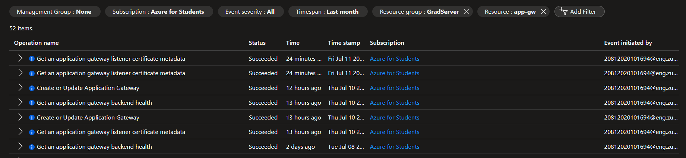
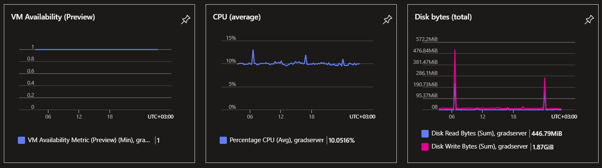
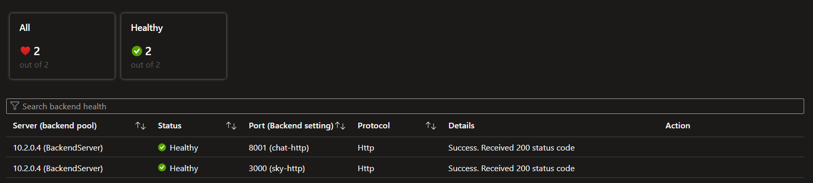
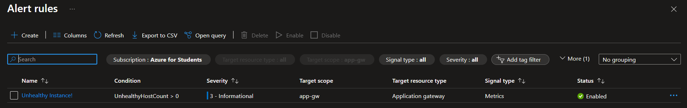
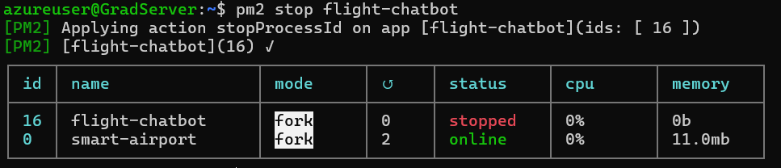
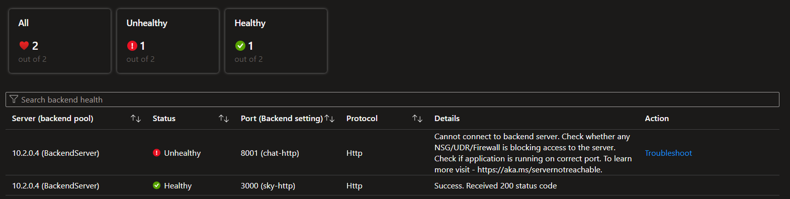
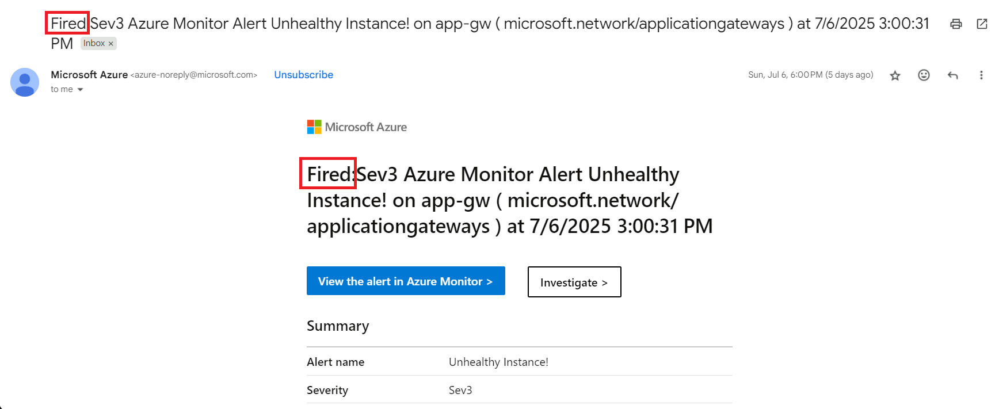
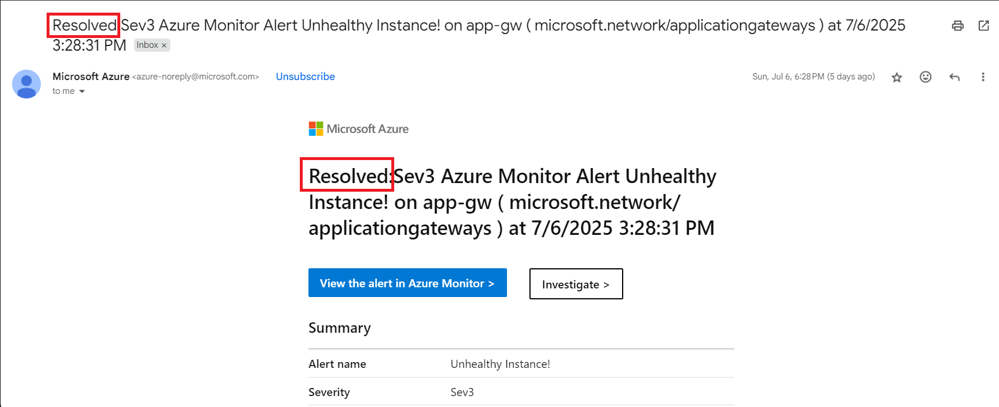

# 📊 Monitoring & Logging

In the **production environment**, having robust monitoring and logging is critical for ensuring:
- ✅ High performance and availability.
- ✅ Faster incident detection and response.
- ✅ Clear visibility into system health and behavior.

This project uses a combination of **Azure’s built-in tools**:  
**Activity Logs**, **Azure Monitor**, and **Azure Alerts**.

---

## 📌 **1) Activity Logs**

### 🔍 What It Does
- The **Activity Log** automatically tracks **all actions and operations** performed on your Azure resources (like the VM and Application Gateway).
- Helps answer: **Who did what, and when?**

### 📌 Use Cases
- Debug unexpected behavior (e.g., an unexpected VM restart).
- Perform root cause analysis for configuration changes or errors.
- Support audit trails for security and compliance.

✅ **Example: Application Gateway Activity Log**  
Provides detailed logs if the VM restarts, stops, or its configuration changes.

---

## 📌 **2) Azure Monitor**

### 🔍 What It Does
- **Azure Monitor** collects real-time metrics and logs from all key resources.
- Visualizes data with charts and dashboards.
- Makes it easy to detect performance bottlenecks or abnormal behavior early.

---

### ⚙️ **VM Monitoring**

Metrics tracked for the VM include:
- **CPU Usage (Average):** Ensures the VM is not over or under-utilized.
- **Disk Bytes (Total):** Monitors read/write activity.
- **Network Traffic (Total):** Shows data flowing in/out.
- **Disk Operations/sec (Average):** Tracks I/O performance.
- **VM Availability:** Confirms that the VM stays online.

✅ **Example: VM Metrics Dashboard**  

---

### ⚙️ **Application Gateway Monitoring**

Metrics tracked for the AGW include:
- **Backend Health:** Status from Health Probes.
- **Request Count:** How much traffic the gateway handles.
- **Latency:** Time taken to process requests.

✅ **Example: Application Gateway Metrics**  

---

## 📌 **3) Azure Alerts**

### 🔍 What It Does
- **Alerts** are rules that watch for specific conditions in your metrics.
- When a condition is met, an **action** is triggered automatically (e.g., send an email).

---

### ⚙️ In This Project

- Alerts are set up for **Backend Health**:
  - If the Health Probe detects that either the Booking or Chatbot app is unhealthy, an alert is triggered.
  - A notification is immediately sent to the team via **Gmail** for quick response.

✅ **Alert Rule in Azure Portal**  

---

✅ **Example Scenario:**

1️⃣ Stop the chatbot app on the VM.  

---

2️⃣ Check the Application Gateway’s Monitoring tab  

---

3️⃣ An email notification is automatically sent to your personal Gmail inbox.

✅ **Fired Email Notification**  

✅ **Resolved Email Notification**  

---

## 🗂️ **Benefits of This Setup**

✔ **Better Visibility**  
- Track performance, availability, and health in real-time.

✔ **Faster Incident Response**  
- Immediate alerts mean less downtime.

✔ **Data-Driven Tuning**  
- Use metrics to optimize performance and plan scaling.

✔ **Strong Audit Trail**  
- Activity Logs keep a secure, detailed history of all actions for compliance.

---

