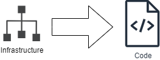

# 🏗️ Infrastructure as Code (IaC)

To keep the production environment **repeatable** and **easy to rebuild**, the whole Azure setup was exported and organized as **Infrastructure as Code (IaC)**.

In this project:
- All main resources (**VM, Application Gateway, Blob Storage, VNet, Subnets, NSGs**) are defined as code.
- This means the same environment can be deployed again anytime without manual clicks in the Azure Portal.
- The IaC files are versioned in the repo, so any change is tracked, and the team can collaborate on infra updates.


---

## ✅ How It Fits This Project

- 🗂️ If the platform needs to run in a **new region**, it’s just `az deployment` (or `terraform apply`).
- ⚙️ When adding new services or scaling, infra changes stay **consistent** with no manual drift.
- 🔐 The code is stored under:  
  [`deployment-scripts/azure-iac/`](../deployment-scripts/azure-iac.json/)

---

## 🧩 **How I Exported the Infrastructure**

To generate the full Infrastructure as Code template for this project, the following steps were done:

1️⃣ **Install Azure CLI**  
   - Download & install: [Azure CLI](https://learn.microsoft.com/en-us/cli/azure/install-azure-cli)

2️⃣ **Login to your Azure account**  
   ```bash
    az login
```
3️⃣ Export the entire Resource Group to a template file
   ```bash
    az group export --name GradServer > fullTemplate.json
```
- Replace GradServer with your Resource Group name.

---
## 📁 Example Resources Covered
- Virtual Network & Subnets: To isolate traffic between AGW and the VM.

- NSGs: To control allowed ports for AGW and backend.

- Application Gateway: With multi-site config and SSL cert bindings.

- Blob Storage: For static website hosting.

- VM: Runs backend apps with PM2.
